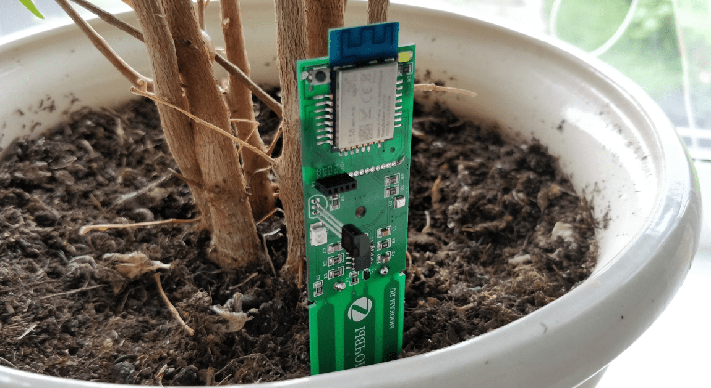

# How to join:
### If device in FN(factory new) state:
1. Press and hold button (1) for 2-3 seconds, until device start flashing led
2. Wait, in case of successfull join, device will flash led 5 times
3. If join failed, device will flash led 3 times

### If device in a network:
1. Hold button (1) for 10 seconds, this will reset device to FN(factory new) status
2. Go to step 1 for FN device

# Troubleshooting

If a device does not connect to your coordinator, please try the following:

1. Power off all routers in your network.
2. Move the device near to your coordinator (about 1 meter).

or if you cannot disable routers (for example, internal switches), you may try the following:

1. Disconnect an external antenna from your coordinator.
2. Move a device to your coordinator closely (1-3 centimeters).
3. Power on, power on the device.
4. Restart your coordinator (for example, restart Zigbee2MQTT if you use it).

### Other checks

Please, ensure the following:

1. Your power source is OK (a battery has more than 3V). You can temporarily use an external power source for testings (for example, from a debugger).
2. The RF part of your E18 board works. You can upload another firmware to it and try to pair it with your coordinator. Or you may use another coordinator and build a separate Zigbee network for testing.
3. Your coordinator has free slots for direct connections.
4. You permit joining on your coordinator.
5. Your device did not join to other opened Zigbee network. When you press and hold the button, it should flash every 3-4 seconds. It means that the device in the joining state.

# How to add device into zigbe2mqtt
Use [external converters](https://www.zigbee2mqtt.io/information/configuration.html#external-converters-configuration) feature

Converter file located [here](./z2m-converter/DIYRuZ_Flower.js)

